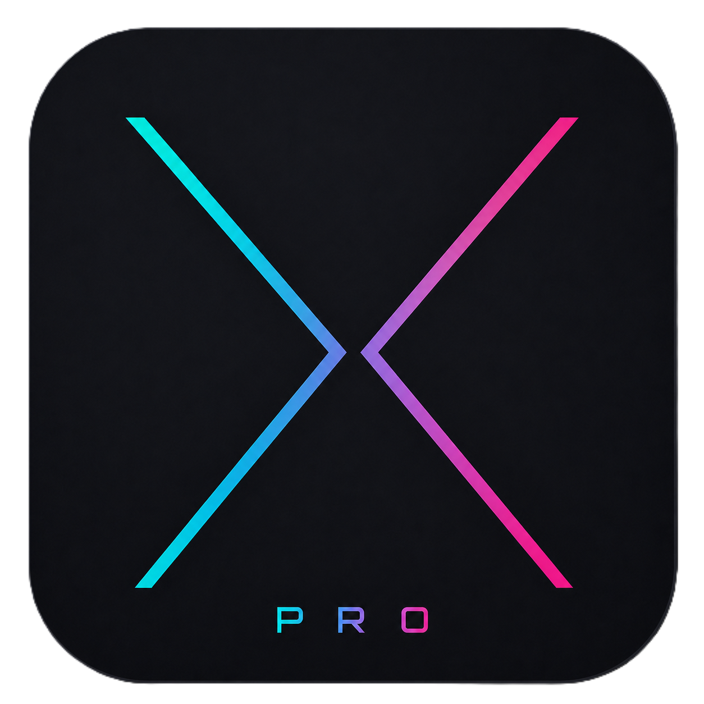
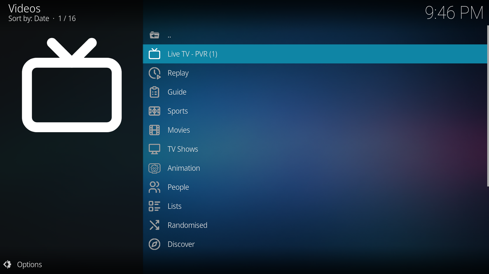
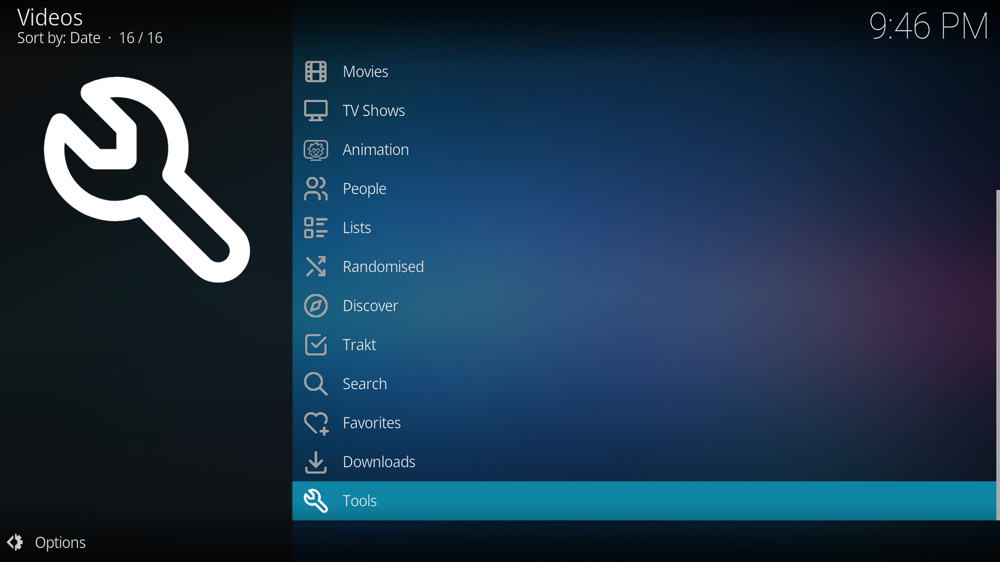
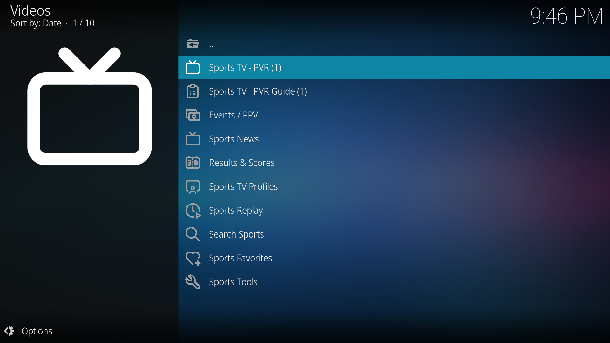
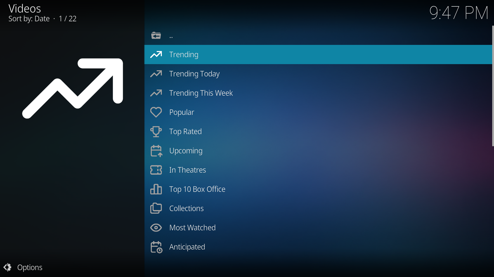
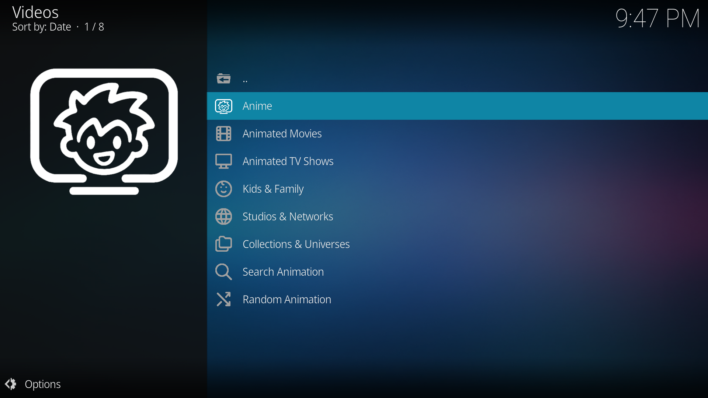

  

# Xstream Pro

> **Advanced M3U and Xtream Codes player for Kodi with native PVR integration, Sports PVR, TMDB, Trakt, EPG, downloads, and multi-profile content management.** Built for organized Live TV, Movies, Series, Replay, and provider libraries with clean Kodi integration.

---

## Table of Contents

- [Overview](#overview)
- [Installation](#installation)
- [Setup](#setup)
- [Content](#content)
- [Features](#features)
- [Auto-Updates](#auto-updates)
- [Requirements](#requirements)
- [License](#license)

---

## Overview

XStream Pro is a feature-rich Kodi addon for Live TV, Movies, Series, Replay, Sports TV, TMDB discovery, and Trakt lists using Xtream Codes API or M3U playlists. It is built for users who want organized provider content, profile separation, Kodi PVR integration, EPG support, favorites, filtering, and fast access to large libraries.

  
  

---

## Installation

### Method 1: Install via File Manager

1. In Kodi, go to **Settings > File Manager**
2. Select **Add Source**
3. Enter the URL: `https://pesicp.github.io/XStreamPro/releases/`
4. Enter a name: `XStreamPro`
5. Click **OK**
6. Go to **Settings > Add-ons > Install from ZIP file**
7. Select the `XStreamPro` source you just added
8. Click on `plugin.video.xstream-pro-*.*.*.zip` (latest version)
9. The addon will install and can check for updates from inside the addon

### Method 2: Direct ZIP Install

1. Download the latest `plugin.video.xstream-pro-*.*.*.zip` from the [releases page](https://github.com/Pesicp/XstreamPro/releases)
2. In Kodi, go to **Settings > Add-ons > Install from ZIP file**
3. Select the downloaded ZIP
4. PVR IPTV Simple Client is required for native PVR features

---

## Setup

1. Open **XStream Pro** from your Video Add-ons
2. Go to **Tools > Settings**
3. Under **Profiles - Xtream, M3U**, configure your source:
   - **Xtream Codes**: Enter server URL, username, password, and optional EPG URL
   - **M3U Playlist**: Enter M3U URL and optional M3U EPG URL
4. Enable the profile if you want it visible in the main menu
5. Use **Load TV, Movies, Series** to load provider content for the profile
6. Use **Manage Content** to choose what loads and what should be hidden
7. Sync PVR when prompted so Live TV appears in Kodi's native TV section
8. Restart Kodi if prompted after PVR setup
9. Open XStream Pro again - your Live TV, Movies, Series, Sports, TMDB, and Trakt menus are ready

---

## Content

### Live TV and PVR

| Feature | Description |
|---------|-------------|
| **Native Live TV PVR** | Export loaded Live TV channels to Kodi's native PVR TV section |
| **Classic Live TV Browsing** | Browse channels directly inside the addon without using Kodi PVR |
| **EPG Support** | Fetch guide data from Xtream XMLTV or a custom M3U EPG URL |
| **Replay / Catchup** | Watch past programs from supported providers |
| **PVR Favorites Manager** | Create custom favorite groups that appear in Kodi PVR |
| **PVR OSD Navigation** | Left opens channels and Right opens guide during fullscreen PVR playback |

### Sports

| Feature | Description |
|---------|-------------|
| **Sports Section** | Detect and organize sports channels from loaded profiles |
| **Sports PVR** | Separate native PVR view for sports channels |
| **Sports Favorites** | Create Sports PVR favorite groups |
| **Sports Results** | SportDB.dev menus for live, today, yesterday, upcoming, standings, and team views |
| **Sports Group Modes** | Group Sports PVR by countries, provider groups, sport types, or flat list |

  

### M3U Playlist Support

| Feature | Description |
|---------|-------------|
| **M3U with Xtream Credentials** | M3U URLs containing username/password can be parsed into Xtream-style profile data |
| **Pure M3U Mode** | Simple playlists can be browsed directly with favorites and search |
| **Separate M3U EPG URL** | Dedicated EPG URL field for M3U sources |
| **Smart Source Handling** | Each profile can independently use M3U or Xtream Codes |

### Multi-Profile System

| Feature | Description |
|---------|-------------|
| **10 Independent Profiles** | Separate credentials, source type, loaded data, cache, favorites, and hidden content |
| **Per-Profile Source Type** | Each profile can use Xtream Codes or M3U playlist |
| **Per-Profile Load Toggles** | Choose whether Live TV, Movies, and Series should load per profile |
| **Active PVR Profile** | Select which profile feeds Kodi's main Live TV PVR |
| **Profile Refresh Tools** | Reload one profile or manage loaded profiles from Tools |

### Favorites

| Category | Feature |
|----------|---------|
| **PVR Favorites** | Create PVR groups that appear as Kodi channel groups |
| **Profile Favorites** | Save Live TV, Movies, Series, and folders into custom groups |
| **Context Menu Integration** | Add or remove favorites from browsed content |
| **M3U Export** | Export favorite groups as M3U playlists |
| **Multiselect Management** | Add or remove many channels at once |

### Metadata and Discovery

| Feature | Description |
|---------|-------------|
| **TMDB Menus** | Browse movies and TV shows by popular, trending, top rated, genres, people, collections, discovery, and more |
| **TMDB Provider Matching** | Match TMDB items to provider content and show availability |
| **Trakt Menus** | Use Trakt lists, watchlist, history, collection, recommendations, and account actions |
| **Rating Posters** | Optional RPDb poster integration |
| **Provider Metadata** | Optionally use provider descriptions, posters, ratings, cast, genre, and duration |

  
  

### Playback and Downloads

| Feature | Description |
|---------|-------------|
| **Source Selection** | Auto-play first source or show sorted source list |
| **Stream Probe Timeout** | Configurable timeout for checking stream details |
| **Custom User-Agent** | Override User-Agent for streams that require it |
| **InputStream Adaptive Toggle** | Optional HLS handling through InputStream Adaptive |
| **Downloads Manager** | Queue, pause, resume, retry, cancel, remove, and clean downloads |
| **Resume Playback** | Choose whether to ask, always resume, or never resume |

### Parental Control and Filtering

| Feature | Description |
|---------|-------------|
| **Adult Category Filtering** | Hide adult categories with keyword detection |
| **PIN Lock** | Protect settings, tools, adult Live TV, adult movies, and adult series |
| **Hidden Content Manager** | Hide and unhide categories or individual items |
| **Watched Item Toggle** | Show or hide watched items in supported views |

### Tools, Cache, Backup

| Feature | Description |
|---------|-------------|
| **Cache Management** | Clear all caches, EPG cache, TMDB/Trakt cache, provider metadata cache, and search history |
| **Backup and Restore** | Save and restore profile data, favorites, settings, and user data |
| **Background Customization** | Set custom background, clear it, or restore addon background |
| **Buffer Settings** | Configure Kodi buffering through addon settings |
| **Update Tools** | Check for updates, rollback to previous version, and view changelog |

---

## Features

- **Live TV PVR** with Kodi native channel and guide integration
- **Sports PVR** for a dedicated sports-only native PVR view
- **Movies and Series** with profile-aware browsing, search, metadata, and watched state
- **Replay / Catchup** for providers that support archive playback
- **Global Search** across loaded profiles and content types
- **TMDB Discovery** for movies, shows, genres, people, collections, recommendations, and provider matching
- **Trakt Integration** for lists, watchlist, collection, history, and account actions
- **Favorites Managers** for classic addon favorites, PVR favorites, and Sports PVR favorites
- **Per-profile caching** with separate loaded data per profile
- **Downloads Manager** with queue and status controls
- **Parental Control** with PIN-protected areas and adult-content hiding
- **Backup and Restore** for addon profile data
- **Auto-refresh** for profile data and PVR/EPG workflows

### Live TV PVR

Live TV PVR exports the selected active PVR profile to Kodi's native TV section. It supports channel groups, XMLTV EPG, catchup metadata, favorites groups, and Kodi PVR navigation.

- Main Live TV PVR uses the selected **Active PVR Profile**
- PVR Favorites can be exported as separate Kodi channel groups
- Hidden categories and hidden items are excluded from PVR sync
- EPG is exported from Xtream XMLTV or configured M3U EPG URL
- PVR OSD shortcuts can open channels and guide during fullscreen playback

### Sports PVR

Sports PVR creates a separate native PVR experience for sports channels detected from loaded profiles.

- Uses Active PVR Profile or a dedicated Sports PVR profile
- Can group by Countries / Regions, Provider Groups, Sport Types, or Flat List
- Supports Sports PVR Favorites groups
- Opens Sports channels directly through Kodi's native TV window

### Favorites Manager - PVR

Create custom PVR favorite groups. Each group appears as a channel group in Kodi's PVR panel through a dedicated PVR favorites instance.

- Create and rename favorite groups
- Add channels from categories or search
- Add or remove multiple channels at once
- Groups appear in PVR as custom favorite channel groups
- Reload PVR after major favorites changes if Kodi does not show the group immediately

### Favorites Manager - Profiles

Create custom favorites groups for Live TV, Movies, Series, and folders from all configured profiles.

- Right-click content anywhere in a profile to add it to favorites
- Rename, export, or delete groups
- Favorites remain separated from provider cache
- Favorite groups can include mixed content types

### Per-Profile Data Separation

Each of the 10 profiles has independent:

- Credentials and source type
- Loaded Live TV, Movies, and Series data
- Favorites and PVR favorites
- Hidden categories and hidden individual items
- Watch history and resume points
- Search history and cache

### Manage Content

Each profile includes **Manage Content** tools in settings.

- Load or unload Live TV, Movies, and Series per profile
- Hide full categories or individual items
- Review hidden items for easy restoration
- Keep unwanted content out of menus and PVR sync

---

## Auto-Updates

| Feature | Description |
|---------|-------------|
| **Built-in Updater** | Check GitHub-hosted releases from inside the addon |
| **Update URL** | `https://pesicp.github.io/XStreamPro/releases/` |
| **One-Click Install** | Download and install update ZIPs through Kodi |
| **Rollback** | Revert to a previous version when available |
| **Check Interval** | Never, on startup, daily, weekly, or monthly |

---

## Requirements

- Kodi 21 (Omega) or later
- PVR IPTV Simple Client
- Internet connection for Xtream, M3U, TMDB, Trakt, SportDB.dev, and update features
- Optional API keys for TMDB, Trakt account authorization, SportDB.dev, and RPDb features

---

## License

https://github.com/Pesicp/XStreamPro/blob/main/LICENCE.txt
